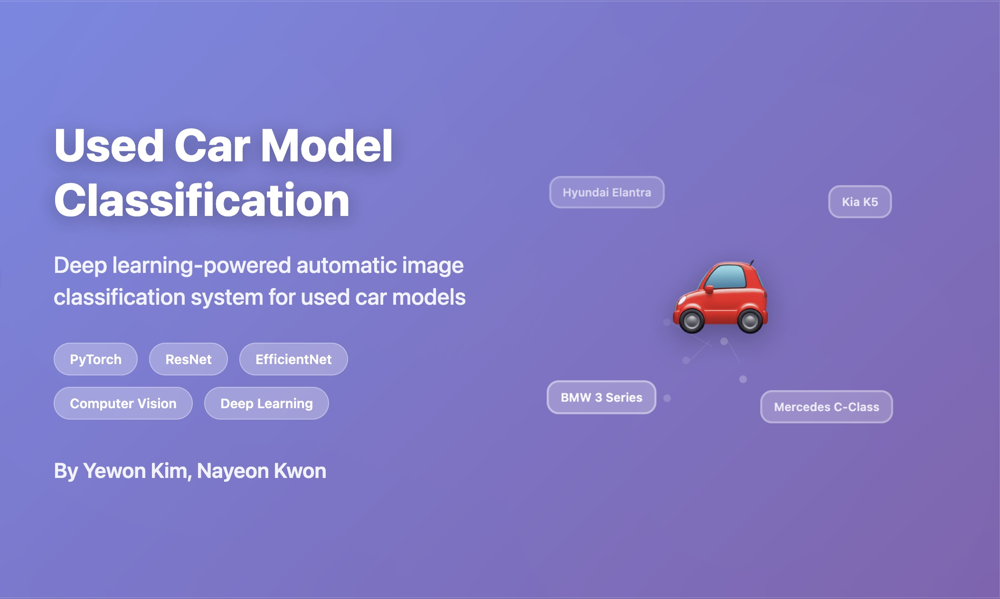

# Used Car Model Classification Project

[한국어](README.md) | English

> ⚠️ **Due to competition rules, dataset and source code cannot be shared.**

<!--
> This repository contains only high-level summaries and pseudocode.
-->

---

## Project Overview

- **Topic**: AI model development for used car model classification from images
- **Objective**: Develop an AI model to accurately classify various used car models from image data and submit to Dacon competition
- **Dataset Structure:**
    - Training data: 33,137 images, 396 classes
    - Evaluation data: 8,258 images

---

## Team Information
- 👩🏻‍💻 [@HaileysArchives](https://github.com/HaileysArchives)
- 👩🏻‍💻 [@KwonNayeon](https://github.com/KwonNayeon)

**Project Period**: May 2025 - June 2025

**Collaboration**: AI Model Development, Data Preprocessing, Analysis

---

## Tech Stack

**Core Technologies**: Deep Learning with PyTorch, Computer Vision models (ResNet, EfficientNet)  
**Data Pipeline**: Python-based preprocessing with NumPy/Pandas  
**Evaluation**: Model performance analysis with scikit-learn

---

## Key Strategies

### 1. Initial Strategy: Two-Stage Approach

**Brand Logo-Based Hierarchical Classification Design**
- **Stage 1**: Brand logo detection and classification within vehicle images using YOLO model
- **Stage 2**: Detailed vehicle model classification using full vehicle images

**Labeling Strategy**
- Established bounding box criteria and proceeded with data labeling through Roboflow
- Attempted combination of manual labeling and AI auto-labeling (Auto Annotate)
- **Constraint**: Failed to implement due to Roboflow Auto Annotate feature requiring paid tokens

### 2. Pivot Strategy: Single-Stage Classification Model

**Strategic Shift Due to Resource Constraints**
- YOLO-based two-stage approach was postponed due to excessive time and resource consumption
- Unable to train on full dataset (33,000 images) due to GPU memory limitations in Google Colab environment
- **Data Optimization**: Sampled down to 10,000 images considering class balance
- Shifted experimental direction to ResNet and EfficientNet-based classification models

---

## Learn More
- **[Summary Report](summary_report.en.md)** - Problem definition and overall results
- **[Troubleshooting](troubleshooting.en.md)** - Technical/data challenges and solutions
- **[Technical Implementation](implementation/)** - Pseudocode
- **[Results Charts](assets/)** - Model performance and training process visualization

---

## Notes

- Original dataset and source code are confidential due to competition regulations
- Model submission follows `sample_submission.csv` format containing class-wise prediction probabilities
- Evaluation metric: Log Loss (analyzed using scikit-learn)